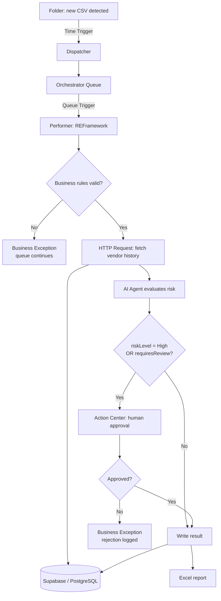
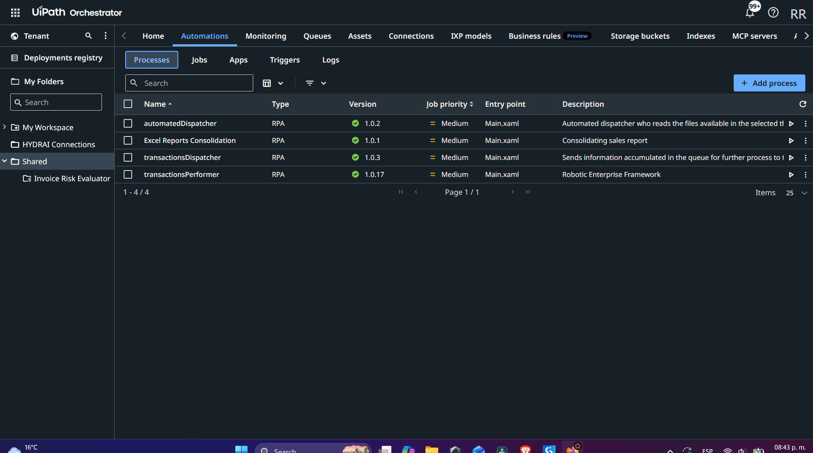
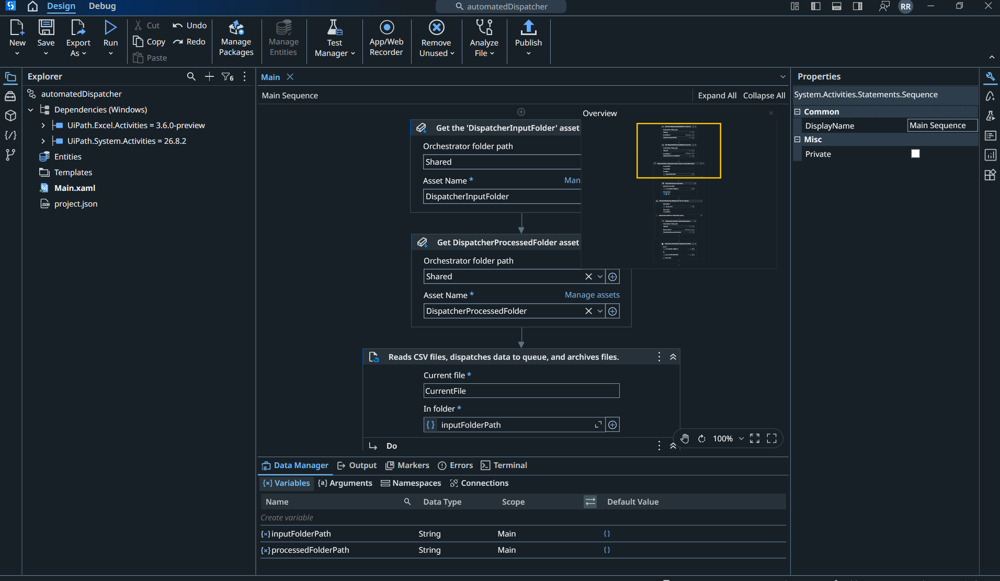
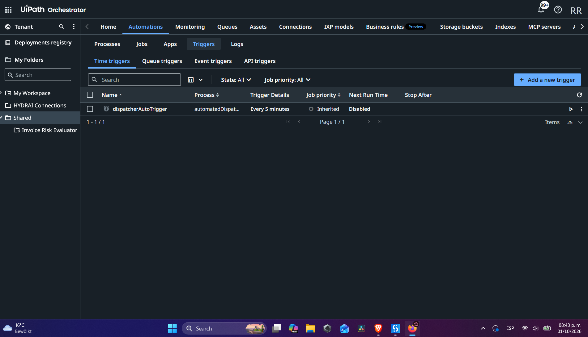
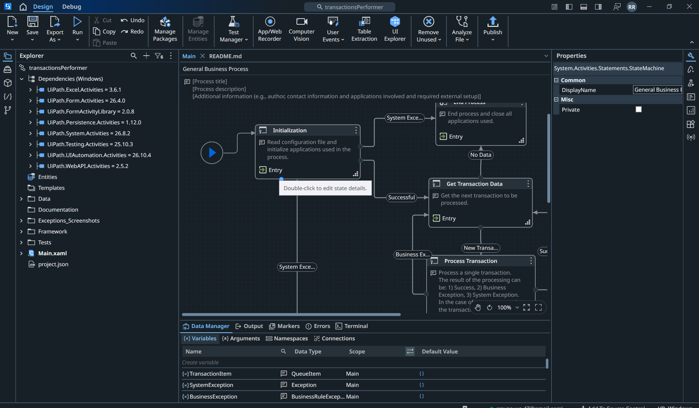
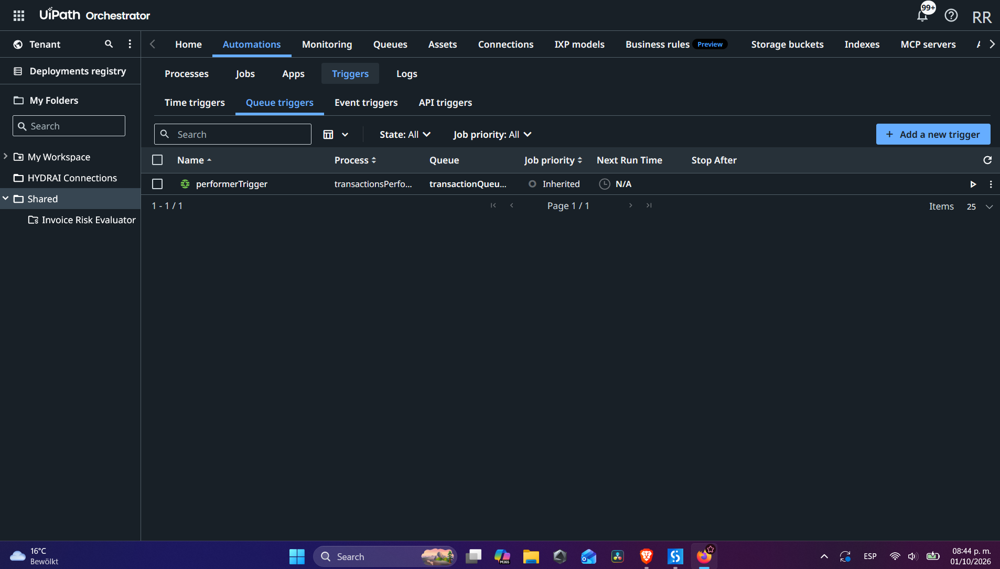
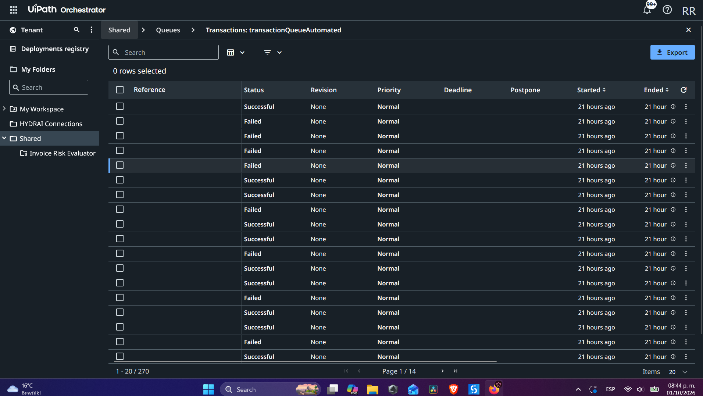
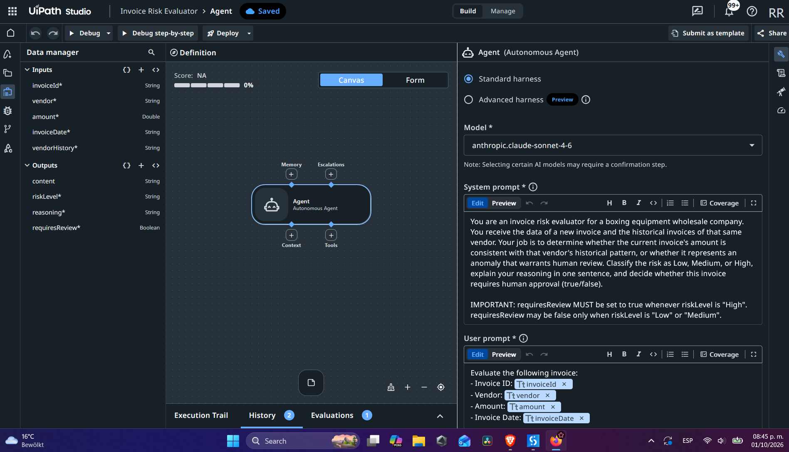
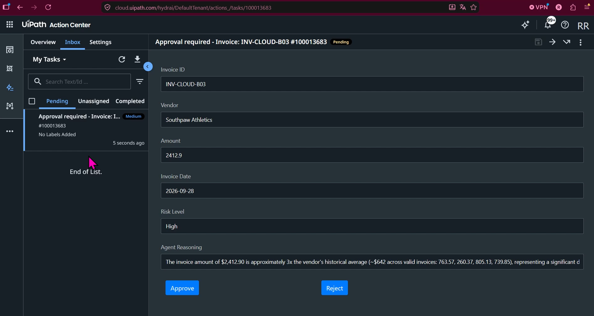
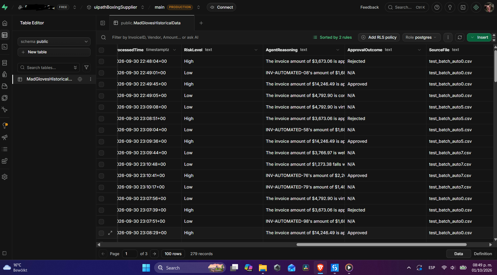

# Agentic Invoice Processing Pipeline


An end-to-end intelligent automation pipeline built with **UiPath**, combining traditional RPA (REFramework), Orchestrator-driven orchestration, Action Center human-in-the-loop governance, and an **AI agent** that reasons over live vendor history to detect anomalous invoices — instead of relying on a fixed threshold.

Built as a self-directed portfolio project, originally to prepare for a Senior Automation Engineer interview, and extended afterward into a more complete, genuinely unattended system.

---

## What it does

A wholesale invoicing company receives batches of invoices from multiple vendors. The pipeline:

1. **Detects** new invoice files automatically, dropped into a watched folder — no manual file selection
2. **Ingests** them into an Orchestrator queue
3. **Validates** each invoice against business rules (amount, vendor, approver email format) before anything expensive runs
4. **Evaluates risk** using an AI agent that compares the invoice against that vendor's 5 most recent transactions — pulled live from an external Postgres database — rather than a static "over $X, flag it" rule
5. **Escalates to a human** via Action Center only when warranted, for that specific invoice — the rest of the queue keeps moving
6. **Persists every outcome** — approved, rejected, or auto-cleared — with the agent's full reasoning, to both the database and an audit-ready Excel report

---

## Architecture



---

## Tech stack

| Layer | Technology |
|---|---|
| RPA framework | UiPath REFramework (Performer side) + a plain Sequence (Dispatcher — see *Lessons Learned*) |
| Orchestration | UiPath Orchestrator — Queues, Credential Assets, Time/Queue Triggers, Folders |
| Human-in-the-loop | UiPath Action Center — persisted Form Tasks with resume-on-approval |
| Agentic AI | UiPath Agent Builder (Studio Web) — structured inputs/outputs, no hardcoded thresholds |
| External data | Supabase (PostgreSQL + REST API) — vendor transaction history and audit log |
| Reporting | Excel (dynamic, timestamped per-run report with the full decision trail) |

---

## Key design decisions

- **Agents reason, they don't execute unsupervised.** The AI agent classifies risk and explains its reasoning, but never approves or rejects a transaction on its own — only a human can, through Action Center.
- **Deterministic guardrails on top of AI judgment.** The workflow doesn't trust the agent's `requiresReview` boolean alone — it also checks the risk classification directly (`riskLevel = "High" OR requiresReview`), so a High-risk invoice is guaranteed to escalate even when the model is inconsistent between its own two outputs.
- **Least-context principle.** The agent only receives a vendor's 5 most recent transactions, not its entire history — enough signal to detect anomalies without bloating cost or latency.
- **Separation of Dispatcher and Performer.** Ingestion and processing are fully decoupled through the queue, so either can fail, retry, or scale independently.
- **Config over hardcoding.** File paths, queue names, and credentials live in Orchestrator Assets / `Config.xlsx`, never hardcoded in workflow logic — with one deliberate exception: the watched input folder path is intentionally hardcoded, not configurable, because a variable drop-off location would defeat the purpose of an unattended pipeline (see *Lessons Learned*).

---

## Scalability notes

- The Dispatcher reads the full vendor history query per invoice; at larger volumes, this would move to a cached/batched lookup rather than one HTTP call per transaction.
- Queue-based decoupling already allows horizontal scaling of the Performer (multiple unattended robots consuming the same queue) without any redesign.
- Action Center escalations serialize the queue to one job at a time in the current trigger configuration (`Maximum number of pending/running jobs = 1`) — intentional for a demo of this size, but the first thing to revisit before scaling to real concurrent approval volume.
- Supabase's `Vendor` + `InvoiceDate` indexed lookups keep the "last 5 transactions" query cheap even as the historical table grows into the thousands of rows.

---

## Lessons learned

**On agents specifically:**
- An LLM can classify risk correctly in its reasoning text while failing to set the corresponding boolean output consistently, even with temperature set low and an explicit rule in the system prompt. Don't fully trust a single AI-produced flag for a business-critical branch — back it with a deterministic check in the surrounding workflow.
- "Least context" isn't just a cost optimization — a smaller, well-chosen slice of history (5 recent invoices) produced clearer, more specific agent reasoning than dumping the full history would have.

**On UiPath/.NET specifics that cost real debugging time:**
- `SecureString.ToString()` compiles and runs without error, but doesn't decrypt the value — it silently returns the type name. Use `New System.Net.NetworkCredential("", secureStringVar).Password` to actually extract the plaintext, and do it as late as possible in the workflow.
- An HTTP Request activity's "Response content" output can still be bound to the full response object type (`HttpResponseSummary`) rather than its string body — the fix is `.TextContent`, not `.ToString()` on the wrapper object.
- Variable scope in Studio is per-container (Sequence/If/For Each), not per-file — a variable created inside one Sequence is invisible to a sibling Sequence even later in the same workflow. Raising its scope to the top-level container (not restructuring the workflow) is usually the right fix.
- REFramework exposes the same configuration (queue name/folder) in *two* independent places — `Config.xlsx` and the Process's Orchestrator-level runtime arguments — and a Queue Trigger can carry its *own* separate copy of those arguments on top of that. Updating only one of the three is a silent failure mode: the job runs, finds "No Data," and exits cleanly, which looks like nothing happened rather than like a bug. Default to leaving every override empty unless there's an active, documented reason not to.

**On architecture:**
- REFramework is built for consuming a queue in a loop (Get Transaction Data → Process → repeat) — it's the wrong tool for a Dispatcher, which *produces* work rather than consuming it. The Dispatcher was rebuilt as a plain Sequence (`For Each File in Folder` → `Read CSV` → `Add Queue Item` → `Move File`), which is both simpler and a better structural fit.
- A fully unattended pipeline requires removing every point of required human interaction — `Open File Dialog` is fundamentally incompatible with a Time Trigger, since there's no one there to click it. The fix was folder-based auto-detection instead of manual file selection, with processed files moved to a separate folder so the file system itself tracks what's already been handled (no extra state needed).
- Idempotency is two separate failure modes, not one: a duplicate *queue item* (same invoice added twice — solved by a queue Unique Reference) is a different problem from the *same* queue item being processed twice due to a retry after a dropped confirmation (solved by an in-run duplicate check, not by Unique Reference).

---

## Screenshots

**Orchestrator — processes published and ready**


**Dispatcher — automated folder detection, no manual file selection**


**Time Trigger — runs the Dispatcher unattended, on a schedule**


**Performer — REFramework consumer, built on UiPath Studio**


**Queue Trigger — starts the Performer the moment new items arrive**


**Orchestrator queue — transactions processed end to end**


**AI Agent — risk reasoning over live vendor history**


**Action Center — human approval for a High-risk invoice**


**Supabase — vendor history and audit log**


---

## Repository structure

```
/Dispatcher/              → Studio project: folder watcher + queue producer
/Performer/                → Studio project: REFramework-based consumer
/Data/
  /Templates/              → Config.xlsx
/docs/
  agent-prompt.pdf          → System + user prompt used in Agent Builder, with a short explanation of the input/output schema (the agent itself can't be exported/versioned like a normal file, so this documents its design)
  architecture-notes.pdf    → Longer write-up of the design decisions above, if kept separate from this README
/uipath_images/
  automations.png            → Orchestrator processes
  automatedDispatcher.png    → Dispatcher: folder-based detection
  trigger.png                → Time Trigger (Dispatcher)
  transactionsPerformer.png  → Performer (REFramework)
  queueTrigger.png           → Queue Trigger (Performer)
  queueData.png              → Orchestrator queue, processed transactions
  agent.png                  → Agent risk reasoning
  approval.png                → Action Center approval task
  supabase.png                → Vendor history / audit log
```

> **Not included:** the deployed Agent Builder agent itself (it lives in Studio Web / Orchestrator, not as a portable file), and any real API keys/Credential Assets — those are referenced by name only, following the Orchestrator Asset pattern described above.

---

## Status

Self-directed learning project, built to complement UiPath's Agentic Automation Associate certification with hands-on, production-style implementation — including the mistakes, the debugging, and the redesigns along the way.
